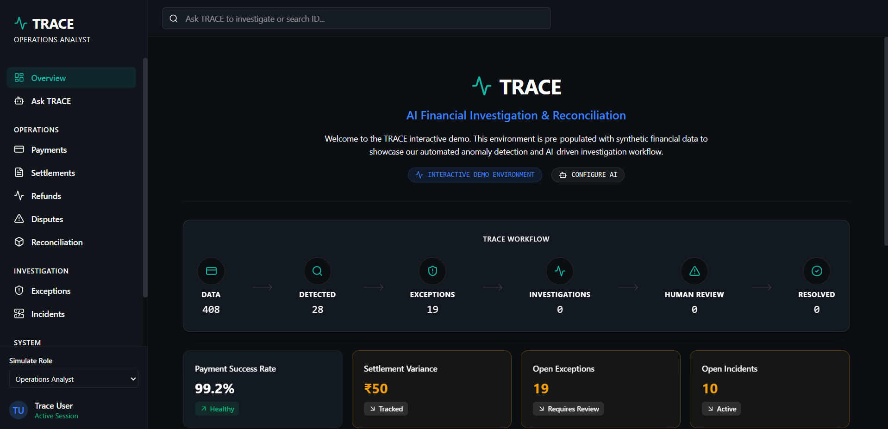
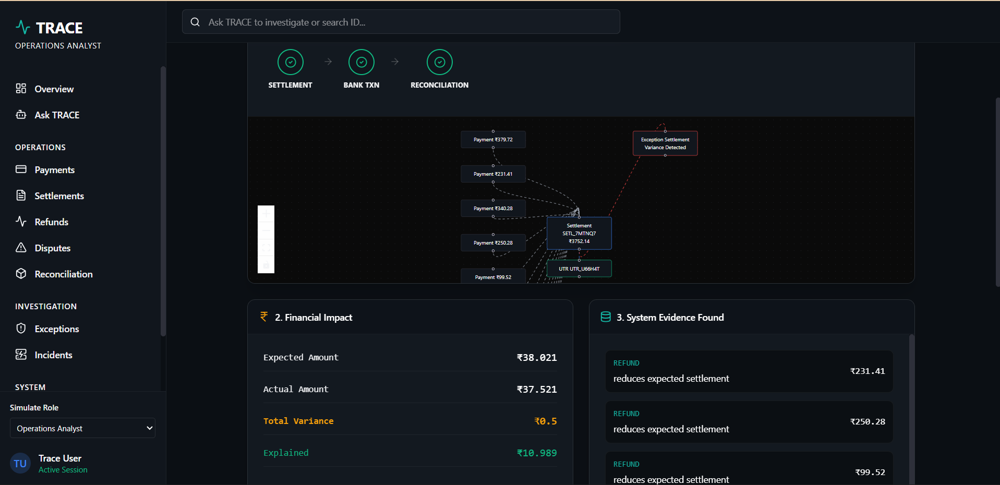
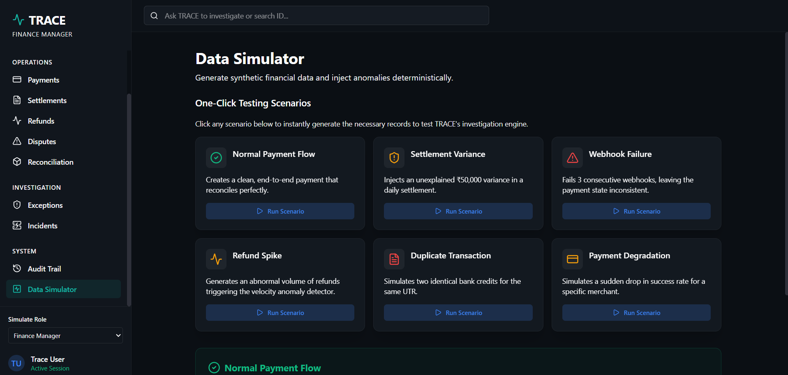

<div align="center">
  
  <h1>TRACE</h1>
  <p><strong>AI-Powered Financial Investigation & Reconciliation Engine</strong></p>
  <p>
    
    
    
    
    
  </p>
</div>

<br />

## 🚀 What is TRACE?

**TRACE** is a production-grade, AI-driven financial operations platform designed to automate the detection, investigation, and resolution of payment anomalies.

Built initially as a hackathon project, TRACE transcends the typical "MVP" by delivering a robust, enterprise-ready architecture. It doesn't just surface data; it acts as an autonomous agent that deeply investigates financial discrepancies (like missing settlements or duplicate refunds) and presents actionable, evidence-backed recommendations to human operators.

---

## 💡 The Problem vs. The Solution

### The Problem
In modern fintech, reconciling millions of transactions across payment gateways, banks, and internal ledgers is a nightmare. When a settlement fails or a payment drops, operations teams spend hours manually traversing databases, logs, and dashboards to find the root cause.

### The TRACE Solution
TRACE acts as a tireless digital financial analyst. By combining a deterministic correlation engine with the reasoning capabilities of **Google Gemini AI**, TRACE instantly:
1. Detects the anomaly.
2. Traverses the financial graph (Payment → Refund → Settlement → Dispute).
3. Synthesizes the evidence.
4. Explains the root cause in plain English.

---

## 📸 Platform Snapshots

### 1. The Interactive Dashboard
The central hub for monitoring system health and AI insights.


### 2. AI Investigation Workspace
Where TRACE breaks down anomalies and presents its findings.


### 3. Ask TRACE (Natural Language Query)
Interact with your financial data using plain English.


---

## 🧠 How We Used AI (Our Uniqueness)

While most projects use AI as a simple chatbot wrapper, TRACE integrates AI deeply into its core business logic as an **Agentic Engine**.

* **Root Cause Analysis:** We feed deterministic graph data (financial relationships) into Gemini. Gemini analyzes ledger timestamps, statuses, and monetary values to deduce *why* a failure occurred (e.g., *"The refund failed because the original payment was disputed prior to settlement"*).
* **Intent Parsing:** Our "Ask TRACE" feature uses AI to classify user intent (Investigate, Query, Explain) and dynamically route the request to the correct internal subsystem before generating a response.
* **Fallback Safety:** AI is used for *reasoning*, but math and state transitions are handled deterministically by our TypeScript backend. This prevents AI hallucinations from affecting financial calculations.

---

## 🛠 Technical Stack

### Frontend
* **React 18** + **Vite** — lightning-fast HMR development and production builds.
* **Tailwind CSS** + **Lucide React** — premium glassmorphism-inspired dark mode UI.
* **React Router** — seamless SPA navigation.

### Backend & Infrastructure
* **Supabase (PostgreSQL)** — relational database with Row Level Security (RLS).
* **Node.js Express / Edge Functions** — deterministic financial math and anomaly generation.
* **Google GenAI SDK** — powers the TRACE investigation brain.

---

## 🏭 Why it's "Production-Ready"

TRACE isn't just a UI mock. It features:
* **Fully Typed Codebase:** End-to-end TypeScript integration across the entire stack.
* **Deterministic Financial Engine:** Uses integer-based math (paise/cents) to prevent floating-point precision errors during reconciliation.
* **Graph Traversal:** DFS/BFS algorithms trace the lifecycle of a payment entity across multiple fragmented database tables.
* **Role-Based Access Control (RBAC):** UI and actions adapt based on whether the user is an Operations Analyst, Auditor, or Finance Manager.
* **Audit Trails:** Every action, AI recommendation, and human approval is immutably logged.
* **Custom AI Key Support:** Users can bring their own Gemini API key or use the system default — configurable directly from the dashboard.

---

## ⚙️ Getting Started

### Prerequisites
* Node.js (v18+)
* Supabase Account
* Google Gemini API Key

### Installation

1. **Clone the repository:**
   ```bash
   git clone https://github.com/Mohana-Sundar-M/Trace_AI.git
   cd Trace_AI
   ```

2. **Install dependencies:**
   ```bash
   npm install
   ```

3. **Set up Environment Variables:**
   Create a `.env` file in the root directory:
   ```env
   VITE_SUPABASE_URL=your_supabase_url
   VITE_SUPABASE_ANON_KEY=your_supabase_anon_key
   VITE_GEMINI_API_KEY=your_gemini_api_key
   ```

4. **Run the application:**
   ```bash
   npm run dev
   ```

5. **Simulate Data:**
   Navigate to the **Data Simulator** tab in the app to instantly seed your database with synthetic financial events and trigger AI investigations!

---

<div align="center">
  <i>Built with ❤️ for the Hackathon — engineered for Production</i>
</div>
